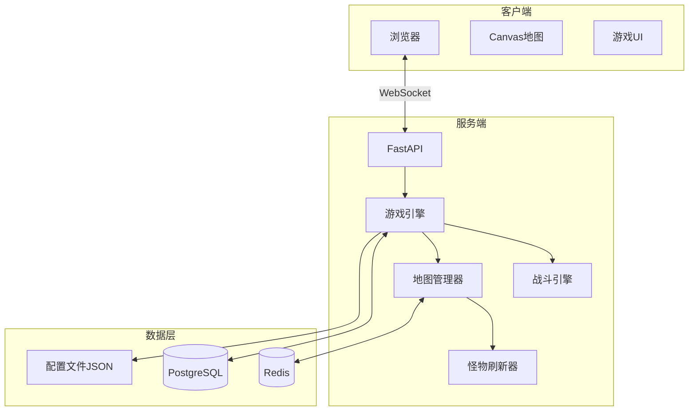
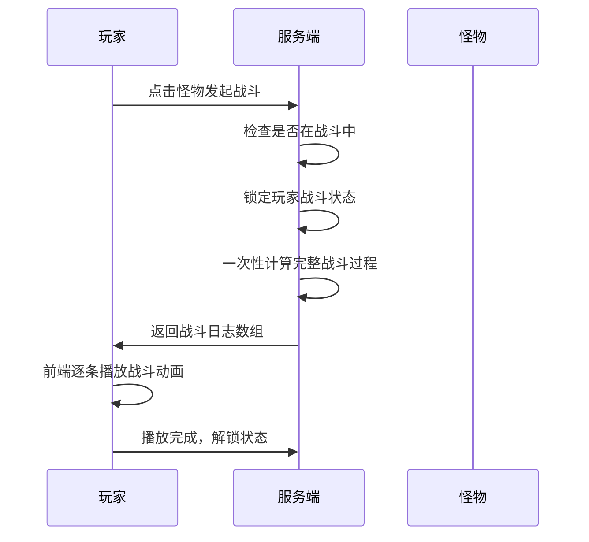

# 传奇2题材纯文字MUD游戏 - 技术方案 v3

## 一、技术选型

### 后端：Python 3.11+ / FastAPI
- WebSocket实时通信
- 异步处理战斗计算

### 数据库：PostgreSQL + Redis
| 组件 | 用途 |
|------|------|
| PostgreSQL | 玩家、角色、物品、技能持久化 |
| Redis | 在线状态、地图怪物状态、战斗锁 |

### 前端：HTML + CSS + JavaScript
- Canvas绘制12x12地图网格
- 迷雾/视野系统
- 点击移动 + 寻路算法

---

## 二、系统架构



---

## 三、核心系统设计

### 1. 地图系统

#### 地图结构
- 每张地图：12x12 = 144格
- 迷宫生成算法（随机或预设）
- 格子类型：通道、墙壁、入口、出口

#### 视野系统
- 玩家初始视野范围（如3x3）
- 走过的格子永久解锁
- 未探索区域显示为迷雾

#### 迷宫生成
- 使用随机迷宫算法（如递归回溯/Prim算法）
- 保证入口到出口有通路
- 每个玩家进入时生成独立实例（或共享实例）

#### 移动机制
- 点击已解锁格子 → A*寻路 → 自动移动
- 遇到怪物阻挡 → 必须战斗
- 战斗中禁止移动

#### 地图连接（传奇2风格）
```
主城（比奇省）
    ├── 沃玛森林 → 沃玛寺庙1层 → 沃玛寺庙2层 → 沃玛寺庙3层（沃玛教主）
    ├── 僵尸洞1层 → 僵尸洞2层 → 僵尸洞3层（尸王）
    ├── 蜈蚣洞1层 → 蜈蚣洞2层 → 蜈蚣洞3层
    └── 祖玛寺庙1层 → ... → 祖玛寺庙7层（祖玛教主）
```

#### 怪物刷新
- 每张地图60只怪
- 定时检查，数量不足则补充
- Boss单独刷新计时器

### 2. 战斗系统

#### 战斗流程


#### 战斗规则
- 每次战斗满状态开始
- 回合制计算（攻击、防御、暴击、闪避）
- 死亡后留在原地（可选择回城）

### 3. 物品系统

#### 品质等级
| 品质 | 颜色 | 属性加成 | 回收货币 |
|------|------|----------|----------|
| 普通 | 白色 | 基础 | 金币 |
| 优秀 | 绿色 | +10% | 金币 |
| 精良 | 蓝色 | +25% | 金币 |
| 史诗 | 紫色 | +50% | 元宝 |
| 传说 | 红色 | +100% | 元宝 |

#### 存储空间
- 背包：200格
- 仓库：1000格
- 背包↔仓库互转

#### 特殊物品
- 祝福油：增加幸运值
- 无持久度属性

### 4. 技能系统

#### 职业技能（传奇2）
- 战士：基础剑法、攻杀剑术、刺杀剑术、半月弯刀、烈火剑法、逐日剑法...
- 法师：火球术、抗拒火环、诱惑之光、地狱火、雷电术、冰咆哮、流星火雨...
- 道士：治愈术、精神力战法、施毒术、灵魂火符、召唤骷髅、隐身术、召唤神兽...

#### 技能获取
- 基础技能：主城书店购买
- 高级技能：僵尸洞掉落、尸王掉落

### 5. 主城系统

主城包含所有NPC：
- 书店（技能书）
- 武器店
- 防具店
- 药店
- 仓库管理员
- 回收商人
- 传送员（快速到达各地图入口）

---

## 四、数据配置文件结构

```
data/
├── maps/
│   ├── main_city.json          # 主城
│   ├── woma_forest.json        # 沃玛森林
│   ├── woma_temple_1.json      # 沃玛寺庙1层
│   ├── woma_temple_2.json
│   ├── woma_temple_3.json
│   ├── zombie_cave_1.json      # 僵尸洞1层
│   ├── zombie_cave_2.json
│   ├── zombie_cave_3.json
│   └── ...
├── monsters/
│   ├── common.json             # 普通怪物
│   ├── elite.json              # 精英怪
│   └── boss.json               # Boss
├── items/
│   ├── weapons.json            # 武器
│   ├── armors.json             # 防具
│   ├── accessories.json        # 饰品
│   ├── consumables.json        # 消耗品
│   └── skillbooks.json         # 技能书
├── skills/
│   ├── warrior.json            # 战士技能
│   ├── mage.json               # 法师技能
│   └── taoist.json             # 道士技能
├── npcs/
│   └── shops.json              # 商店NPC
└── config/
    ├── quality.json            # 品质加成配置
    ├── recycle.json            # 回收价格配置
    └── spawn.json              # 刷怪配置
```

---

## 五、项目目录结构

```
mud-legend/
├── backend/
│   ├── main.py
│   ├── config.py
│   ├── models/
│   │   ├── player.py
│   │   ├── character.py
│   │   ├── item.py
│   │   ├── skill.py
│   │   └── monster.py
│   ├── game/
│   │   ├── engine.py
│   │   ├── combat.py
│   │   ├── map_manager.py
│   │   ├── pathfinding.py      # A*寻路
│   │   ├── spawner.py          # 怪物刷新
│   │   └── commands.py
│   ├── websocket/
│   │   └── manager.py
│   └── api/
│       ├── auth.py
│       ├── character.py
│       └── inventory.py
├── frontend/
│   ├── index.html
│   ├── css/
│   │   └── style.css
│   └── js/
│       ├── game.js
│       ├── map.js              # 地图渲染
│       ├── combat.js           # 战斗动画
│       └── websocket.js
├── data/                       # 配置文件（见上）
├── requirements.txt
├── docker-compose.yml
└── README.md
```

---

## 六、开发路线图

### 阶段1：基础框架
1. FastAPI + WebSocket通信
2. 用户注册/登录
3. 角色创建（战士/法师/道士）
4. 前端基础UI

### 阶段2：地图系统
1. 12x12地图生成
2. Canvas渲染 + 迷雾系统
3. A*寻路 + 点击移动
4. 地图连接（入口/出口）

### 阶段3：战斗系统
1. 怪物配置加载
2. 战斗计算引擎
3. 战斗日志生成
4. 前端战斗播放

### 阶段4：物品系统
1. 物品配置加载
2. 背包/仓库
3. 装备穿戴
4. 物品回收

### 阶段5：技能系统
1. 技能配置加载
2. 技能学习
3. 战斗中使用技能

### 阶段6：完善
1. 怪物定时刷新
2. Boss系统
3. 主城NPC完善
4. 平衡性调整

---

## 七、关键配置文件示例

### monsters/common.json
```json
{
  "chicken": {
    "name": "鸡",
    "level": 1,
    "hp": 10,
    "attack": 2,
    "defense": 0,
    "exp": 5,
    "drops": [
      {"item": "chicken_meat", "rate": 0.5}
    ]
  },
  "deer": {
    "name": "鹿",
    "level": 2,
    "hp": 20,
    "attack": 5,
    "defense": 1,
    "exp": 10,
    "drops": []
  }
}
```

### items/weapons.json
```json
{
  "wooden_sword": {
    "name": "木剑",
    "type": "weapon",
    "class": ["warrior"],
    "level_req": 1,
    "base_attack": 5,
    "buy_price": 100,
    "recycle_gold": 10
  },
  "judgement": {
    "name": "裁决之杖",
    "type": "weapon",
    "class": ["warrior"],
    "level_req": 35,
    "base_attack": 45,
    "buy_price": 0,
    "recycle_yuanbao": 50,
    "drop_only": true
  }
}
```

### config/quality.json
```json
{
  "white": {"name": "普通", "color": "#FFFFFF", "bonus": 1.0, "currency": "gold"},
  "green": {"name": "优秀", "color": "#00FF00", "bonus": 1.1, "currency": "gold"},
  "blue": {"name": "精良", "color": "#0088FF", "bonus": 1.25, "currency": "gold"},
  "purple": {"name": "史诗", "color": "#AA00FF", "bonus": 1.5, "currency": "yuanbao"},
  "red": {"name": "传说", "color": "#FF0000", "bonus": 2.0, "currency": "yuanbao"}
}
```

### 6. PVP系统

#### PVP模式
- 安全区：主城内禁止PVP
- 野外PK：地图中可自由攻击其他玩家
- 红名系统：杀人增加PK值，PK值高变红名

#### PVP规则
- 双方满状态开始
- 战斗计算同PVE
- 死亡掉落部分物品（红名掉落更多）
- PK值随时间降低

### 7. 行会系统

#### 行会功能
- 创建行会（消耗金币/元宝）
- 会长/副会长/成员等级
- 行会聊天频道
- 行会仓库（共享存储）

### 8. 充值系统

#### 元宝获取
- 充值购买（1元=10元宝）
- 高级物品回收
- 活动奖励

#### 商城
- 元宝商城购买特殊物品
- VIP系统（经验加成、掉落加成）

---

## 八、数据库设计

### 核心表
```sql
-- 用户表
users (id, username, password_hash, email, created_at)

-- 角色表
characters (id, user_id, name, class, level, exp, gold, yuanbao, hp, mp, attack, defense, luck, pk_value)

-- 背包表
inventory (id, character_id, item_id, quality, slot, quantity)

-- 仓库表
warehouse (id, character_id, item_id, quality, slot, quantity)

-- 装备表
equipment (id, character_id, slot, item_id, quality)

-- 技能表
character_skills (id, character_id, skill_id, level)

-- 行会表
guilds (id, name, leader_id, level, gold, created_at)

-- 行会成员表
guild_members (id, guild_id, character_id, rank, joined_at)

-- 充值记录
recharge_logs (id, user_id, amount, yuanbao, created_at)
```

---

## 九、开发路线图（完整版）

### 阶段1：基础框架
1. FastAPI + WebSocket通信
2. 用户注册/登录
3. 角色创建（战士/法师/道士）
4. 前端基础UI

### 阶段2：地图系统
1. 随机迷宫生成算法
2. Canvas渲染 + 迷雾系统
3. A*寻路 + 点击移动
4. 地图连接（入口/出口）

### 阶段3：战斗系统
1. 怪物配置加载
2. 战斗计算引擎
3. 战斗日志生成
4. 前端战斗播放

### 阶段4：物品系统
1. 物品配置加载
2. 背包/仓库
3. 装备穿戴
4. 物品回收

### 阶段5：技能系统
1. 技能配置加载
2. 技能学习
3. 战斗中使用技能

### 阶段6：PVP系统
1. 野外PK机制
2. 红名系统
3. 死亡掉落

### 阶段7：行会系统
1. 行会创建/管理
2. 行会聊天
3. 行会仓库

### 阶段8：充值系统
1. 充值接口
2. 元宝商城
3. VIP系统

### 阶段9：完善优化
1. 怪物定时刷新
2. Boss系统
3. 平衡性调整
4. 性能优化